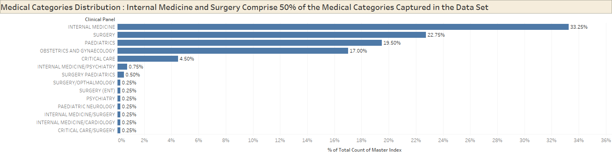
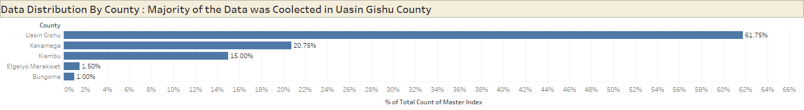
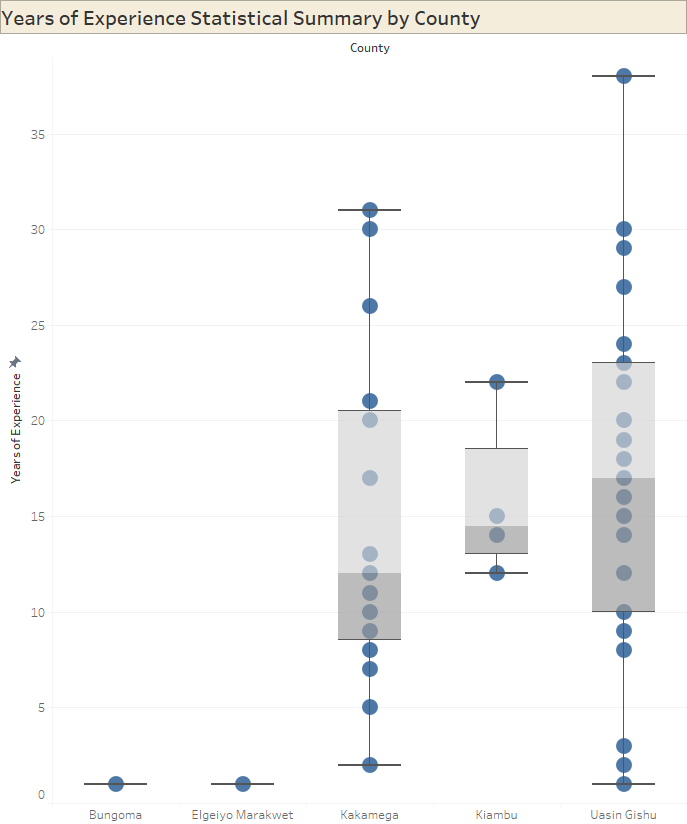
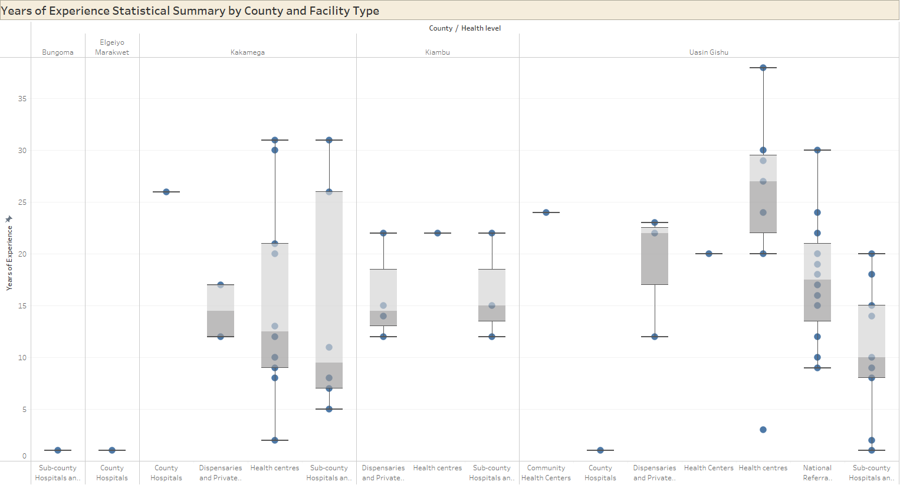
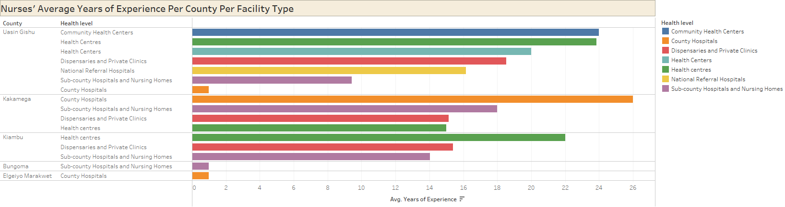
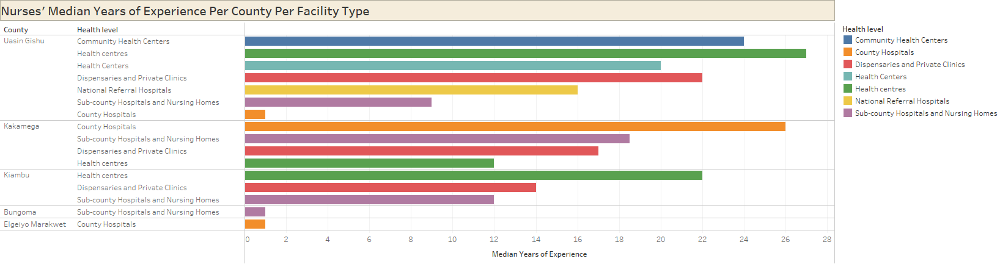
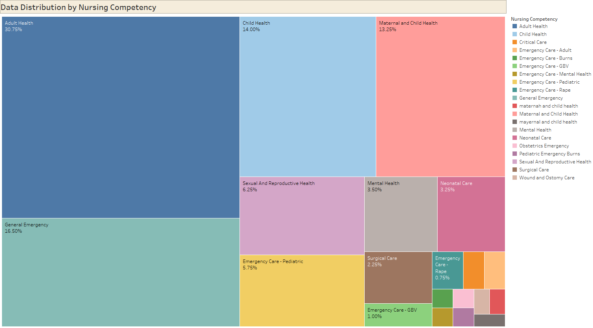

# Improving Clinical Reasoning with AI : Lessons from 400 Kenyan Case Vignettes

## Business Understanding
In Kenya, frontline nurses often face high-stakes clinical decisions under intense pressure and with limited resources. These healthcare workers operate in environments where specialist support is scarce, yet their judgment can mean the difference between life and death.
The rise of large language models (LLMs) such as GPT-4, LLAMA, and GEMINI offers a potential support system for healthcare workers—either by providing second opinions or pre-screening suggestions. However, these systems must first be proven to emulate the reasoning and decision-making patterns of real, trained clinicians.
This project explores whether AI models can replicate or assist clinical decision-making in real Kenyan medical contexts.

## 🎯 Problem Statement
1. Rural Kenyan healthcare workers make critical decisions with limited resources
2. 	Nurses across different counties and facility levels face complex medical situations daily
3. 	Need for AI that can match human clinical reasoning in low-resource settings

---

## 🧪 Objectives

**Initial Objectives**
- Extract structured information (like nurse experience) using RegEx.
- Use sentence embeddings to compare AI vs human responses.
- Analyze tone and empathy with sentiment analysis.
- Use NLP foundations (Bag-of-Words, TF-IDF) for text statistics.
- Apply classification (predict medical specialty from prompt).

**New Objectives**

The goal is to train a model that can predict the clinician’s response to each complex clinical prompt, effectively mimicking the decision-making of trained healthcare professionals.

1. Build an AI model that can replicate clinical reasoning of human healthcare professionals.
2. Compare predictions from  models with outputs from existing LLMs (GPT-4, LLAMA, GEMINI).
3. Measure response similarity between predicted vs. real clinician answers using semantic metrics (e.g., BERTScore, BLEU, ROUGE).

4. Evaluate factual accuracy of responses based on DDX SNOMED codes (clinical diagnosis correctness).

5. Explore impact of nurse metadata (e.g., experience level, health facility) on model accuracy.

Find a way to combine these
---

## 🗃️ Dataset Summary
- 400 training samples, 100 test samples.
- Fields: Prompt, Clinician response, GPT-4, LLAMA, GEMINI.
- Metadata: County, Health level, Nursing Competency, Experience.
- Labels: SNOMED CT diagnostic codes.

<figure>
    
    <figcaption>Data Dictionary</figcaption>
</figure>

## 📊 EDA

<figure>
    
    <figcaption>Medical Categories Distribution</figcaption>
</figure>

Internal Medicine and Surgery comprise 50% of the cases in these hospitals.

<figure>
    
    <figcaption>MData Distribution By County</figcaption>
</figure>

Majority of the data was collected from medical facilities in Uasin Gishu county

<figure>
    
    <figcaption>Years of Experience Statistical Summary by County</figcaption>
</figure>

Uasin Gishu county generally has more experience nurses

<figure>
    
    <figcaption>Years of Experience Statistical Summary by County and Facility Type</figcaption>
</figure>

Uasin Gishu Health Centres are the Medical Facility type with the highest Nurse Experience

<figure>
    
    <figcaption>Nurses' Average Years of Experience Per County Per Facility Type</figcaption>
</figure>

The regional average number of years of experience by medical facility type can be used to impute missing Years of Experience data

<figure>
    
    <figcaption>Nurses' Median Years of Experience Per County Per Facility Type</figcaption>
</figure>

The regional median number of years of experience by medical facility type can be used to impute missing Years of Experience data

<figure>
    
    <figcaption>Data Distribution by Nursing Competency</figcaption>
</figure>

Adult Health and General Emergency cases comprise approximately 50% of the cases in these regions

A text comparison of the Clinician Responses and the NLP Models Responses showed the following:
<figure>
    
    <figcaption>Clinician vs NLP Responses Text Summary</figcaption>
</figure>

Generally, Human Clinicians are significantly more concise than AI models. To improve clinical utility, an AI model would need to learn to be **brief and focused**, and not overly verbose.

insert stories about cleaning here
---

## 🔧 Techniques Used

### ✅ Regular Expressions
Used to extract number of years of experience from nurse prompts.

### ✅ Word Embeddings
Used `SentenceTransformer` (MiniLM) to compare how close AI and clinician answers are in meaning.

### ✅ Bag-of-Words (BoW)
Used `CountVectorizer` to find most common words and build a word frequency matrix.

### ✅ Corpus Statistics
Counted tokens, characters, vocabulary size, and average words per clinician response.

### ✅ TF-IDF Vectorization
Used `TfidfVectorizer` to detect which words carry more weight in responses.

### ✅ Text Classification
Built a Naive Bayes classifier to predict the medical specialty (Clinical Panel) based on the prompt.

---

## 📊 Evaluation Metrics
- **Cosine Similarity** (semantic overlap)
- **Sentiment Score** (using VADER)
- **Classification Report** (precision, recall, F1)

---

## 🔍 Manual Review
Spot-checked AI responses against human clinician answers for reasoning quality and tone.

---

## 💡 Key Insights
- GPT-4 had high similarity but sometimes lacked empathy.
- Nurse experience in the prompt matched metadata ~100%.
- SNOMED codes varied per case but were properly extractable.

---

## 📈 Recommendations
- Use AI as decision support only, not as replacements.
- Highlight and validate medical facts with SNOMED-based rules.
- Train AI on regional data for cultural and clinical safety.

---

## 🔮 Future Work
- Evaluate LLAMA and GEMINI on same metrics.
- Use topic modeling (e.g., BERTopic) to group vignettes.
- Add multi-turn Q&A and chat capability.
- Develop a real-time RAG system for field use.

